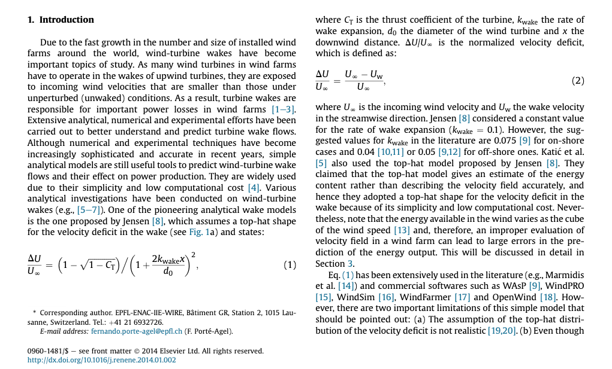
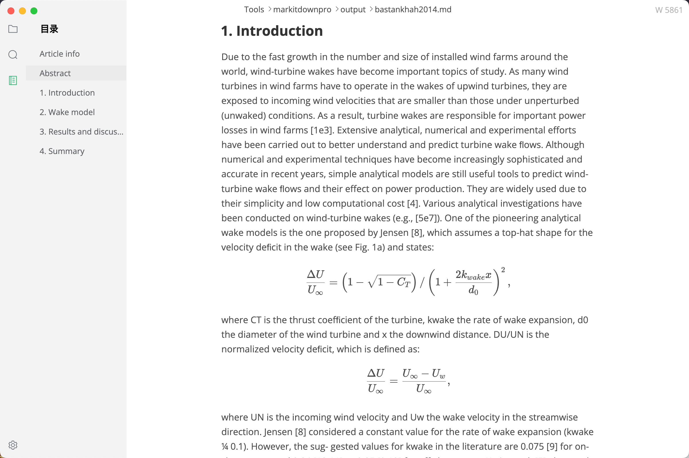

# MarkItDownPro

MarkItDownPro is a local document-to-Markdown tool built on top of several open-source projects, with a stronger focus on academic and technical PDF conversion.

The goal is not to fork or replace the upstream projects. MarkItDownPro is an integration layer that keeps upstream packages as editable dependencies under `vendor/`, then adds a PDF pipeline that improves reading order, figures, tables, formulas, and local model/cache management.

The current implementation focuses on enhanced PDF-to-Markdown conversion and basic DOCX-to-Markdown conversion. PDF files use the custom layout-aware pipeline; DOCX files are converted through MarkItDown's DOCX converter.

## Relationship to Upstream Projects

MarkItDownPro combines these projects:

- [microsoft/markitdown](https://github.com/microsoft/markitdown): provides the general document conversion interface and non-PDF conversion foundation.
- [PDFMathTranslate/PDFMathTranslate](https://github.com/PDFMathTranslate/PDFMathTranslate): provides the `pdf2zh` / BabelDOC layout detection components used to locate figures, tables, and isolated formulas in PDF pages.
- [OleehyO/TexTeller](https://github.com/OleehyO/TexTeller): provides formula OCR for detected formula regions.
- [PyMuPDF](https://pymupdf.readthedocs.io/): used directly by MarkItDownPro for PDF text ordering, region rendering, table detection, and PDF repair fallbacks.

This repository keeps those upstream packages in a minimal vendored form so the integration can be developed and tested locally without changing global Python packages. Project-specific logic lives in `src/markitdownpro/`.

## PDF Conversion Preview

Original two-column academic PDF:



Converted Markdown preview with reconstructed section structure, reading order, and formula rendering:



## What MarkItDownPro Adds

- A simplified CLI:

  ```bash
  markitdownpro path/to/input.pdf
  ```

- Default output under `output/<short_input_stem>/<short_input_stem>.md`.
- A copy of the original source file saved in the same output folder.
- Extracted PDF and DOCX image assets under `output/<short_input_stem>/<short_input_stem>_assets/`.
- Project-local model cache under `.cache/`, avoiding scattered user-level model files.
- Layout-aware PDF conversion for academic papers and technical documents.
- Better handling for double-column PDFs.
- Formula OCR for detected isolated formulas.
- Figure extraction as Markdown image references.
- Table regions rendered as images when table-to-Markdown extraction is unreliable.
- Basic heading detection for numbered academic sections and Chinese technical documents.
- PDF repair fallback for some malformed resource dictionaries seen in real-world PDFs.

## Layout

```text
.
├── src/markitdownpro/          # MarkItDownPro integration package and CLI
├── vendor/                     # Minimal editable upstream dependency roots
│   ├── markitdown/
│   ├── pdf2zh/
│   └── texteller/
├── pyproject.toml              # Root package and uv dependency configuration
├── uv.lock
└── README.md
```

`examples/`, `output/`, `.cache/`, and `.venv/` are intentionally ignored by Git.

Long input names are shortened with regex-based cleanup and an 8-character hash suffix. The same shortened stem is used for the output folder, Markdown file, copied source file, and PDF asset folder.

## Installation

Use Python 3.12 and `uv`:

```bash
uv sync
```

## Usage

Convert a PDF and write the result to `output/<short_input_stem>/<short_input_stem>.md`:

```bash
uv run markitdownpro path/to/input.pdf
```

Convert a DOCX file:

```bash
uv run markitdownpro path/to/input.docx
```

Write to a specific file:

```bash
uv run markitdownpro path/to/input.pdf -o path/to/output.md
```

Write to a specific output directory:

```bash
uv run markitdownpro path/to/input.pdf -o path/to/output-folder
```

Disable formula OCR for a faster pass:

```bash
uv run markitdownpro path/to/input.pdf --no-pdf-formula-ocr
```

The explicit subcommand form is also supported:

```bash
uv run markitdownpro convert path/to/input.pdf -o path/to/output.md
```

## Model Cache

Runtime model downloads are kept inside the project by default:

```text
.cache/
├── babeldoc/      # PDFMathTranslate/BabelDOC doclayout models
├── huggingface/   # TexTeller main model and tokenizer
├── texteller/     # TexTeller helper ONNX OCR models
└── torch/
```

Override the root only when needed:

```bash
MARKITDOWNPRO_CACHE_DIR=/path/to/cache uv run markitdownpro path/to/input.pdf
```

## Development

```bash
uv sync
uv run python -m compileall src
```

Keep integration changes in `src/markitdownpro/`. Avoid modifying vendored upstream code unless the change is required for local packaging or is being prepared deliberately as an upstream patch.

## Notes

PDF conversion quality depends on PDF structure and layout detection quality. For tables, MarkItDownPro currently prefers preserving visual fidelity by inserting detected table regions as images instead of forcing unreliable Markdown tables.
